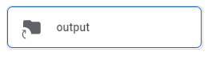
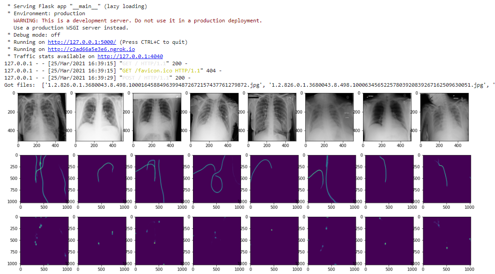

# Doctor's Cyclop Model

**Doctor's Cyclop** is one project of the **Phoenix team** in **FPT Edu Hackathon 2021**. This repository contains code of the model implementation. For the Web App, view 
[Doctors-Cyclop-Webapp](https://github.com/DAN3002/Doctors-Cyclop-Webapp)

## Introduction

This is a Model implementation integrated with Web App, the dataset is got from the [RANZCR CLiP - Catheter and Line Position Challenge](https://www.kaggle.com/c/ranzcr-clip-catheter-line-classification)

After researching and referring from discussions on Kaggle, here is our model solution:

Our pipeline has 2 stages: **Segmentation** and **Classification**

### Models:

- **Stage 1**: Segmentation Model
  - Using **Unet++** with **EfficientNet-B1** as backbone
  - Train and validate on images with annotations
  - For official segmentation annotation, we make 2 channel masks by drawing lines representing the tube, and drawing big dots indicating the tips of tubes.
- **Stage 2**: Classification Model
  - Using custom **EfficientNet-B1 trained with noisy student**
  - Input has 5 channels (3 channels from original image, resized to 1024x1024 + 2 channels from predicted masks)
  - Output is 12 classes: original 11 plus no-ETT, defined as whether all 3 ETT classes are 0
  - Loss is weighted average of CE loss for the 4 ETT classes and BCE loss for the other 8 classes, with weight being 1:9

### Training:

After 5 folds Segmentation models are all trained with original dataset, we'll generate masks for all images, including those without annotation ones.

We'll then use the predicted masks, and the images get resized to 1024x1024 as input to train stage 2 - classification models.

Then, the trained model's weights in each fold are stored in Google Drive, and will be mounted when running Online Prediction Service

## How to Build and Run

### 1. Mount folders at Google Drive

- Create shortcut (mount) to this [public folder](https://drive.google.com/drive/folders/1XxKDVzCms_O6UVG2zNKvmwV0rNtTmtIq?usp=sharing), add at your Google Drive's root (`/`):

After this you should now have this at your Google Drive's root:

### 2. SSH to server

- Run [this notebook](https://colab.research.google.com/drive/1L-ibyztYYcM0rmuXkPihN8LHP0TxkRi4?usp=sharing) with GPU enabled to create a Google Colab virtual machine
- Copy file [setup.sh](setup.sh) or [restapi-setup.sh](restapi-setup.sh) to the newly created virtual machine (by `scp`)

### 3. Run

- `ssh` to the created machine *(default password is `haha`)*, then run **either**:
  - [restapi-setup.sh](restapi-setup.sh) to start **Online Prediction Server** as a RestAPI service
  - [setup.sh](setup.sh) for **Training**:
    - The default is training *Classification*
    - To train *Segmentation* instead, change `is_seg` to `true` in [setup.sh](setup.sh)

### 4. Note:
- **When training:** Logs and checkpoints are automatically mounted at `%Your-Google-Drive-Root%/log/`

- **When start Online Prediction Server as a service:** RestAPI is callable at `/`, you can `tmux` to this remote machine to get public API endpoint

